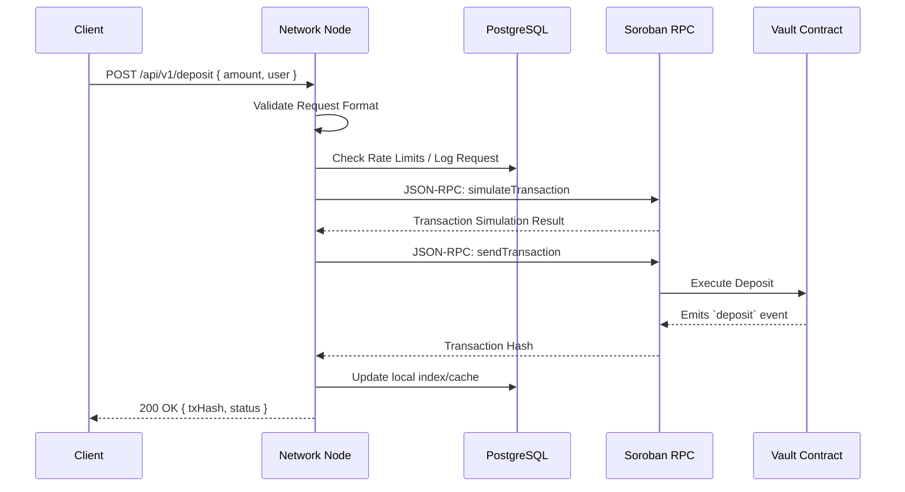

# Axionvera Network Architecture

This document provides a comprehensive overview of the Axionvera Network architecture to facilitate contributor onboarding. It details the network topology, component interactions, node communication mechanisms, and data dependencies.

## Network Topology

The Axionvera Network consists of a decentralized set of nodes interfacing with the Soroban smart contract network and a PostgreSQL database for off-chain state management. 

```mermaid
graph TD
    %% Define Nodes
    Client[Client Applications / dApps]
    ALB[Application Load Balancer]
    
    subgraph "Axionvera Network (AWS VPC)"
        API1[Network Node 1 (API)]
        API2[Network Node 2 (API)]
        Worker[Background Worker Node]
        
        DB[(PostgreSQL 15+)]
        Redis[(Redis Cache)]
    end
    
    subgraph "Stellar Network"
        Soroban[Soroban RPC]
        StellarCore[Stellar Core]
    end

    %% Connections
    Client -- "HTTPS (REST)" --> ALB
    ALB -- "HTTP (Port 8080)" --> API1
    ALB -- "HTTP (Port 8080)" --> API2
    
    API1 -- "TCP/IP (Port 5432)" --> DB
    API2 -- "TCP/IP (Port 5432)" --> DB
    Worker -- "TCP/IP (Port 5432)" --> DB
    
    API1 -- "TCP/IP (Port 6379)" --> Redis
    API2 -- "TCP/IP (Port 6379)" --> Redis
    
    API1 -- "JSON-RPC (HTTPS)" --> Soroban
    API2 -- "JSON-RPC (HTTPS)" --> Soroban
    Worker -- "JSON-RPC (HTTPS)" --> Soroban
    
    Soroban --- StellarCore
```

### Component Overview

- **Network Nodes (API)**: Rust-based Axum servers that handle incoming client requests, validate transactions, and interact with the database and Soroban RPC.
- **Background Worker Node**: Processes asynchronous tasks, such as reward distribution cron jobs or transaction finality monitoring.
- **Application Load Balancer (ALB)**: Distributes incoming HTTPS traffic across the active Network Nodes to ensure high availability.
- **Database (PostgreSQL)**: Stores off-chain metrics, cached user data, and request logs.
- **Redis Cache**: Optional component for rate limiting and session management.

## Node-to-Node Communication

While Axionvera nodes primarily act as independent gateways to the Soroban contract, they communicate with the database and internal services using structured protocols.

### Communication Mechanisms

1. **Client to Network Node**
   - **Protocol**: HTTPS / REST
   - **Message Format**: JSON payloads
   - **Handshake**: Standard TLS handshake followed by API key validation (if applicable).

2. **Network Node to Database**
   - **Protocol**: TCP/IP (Port 5432)
   - **Message Format**: PostgreSQL Wire Protocol
   - **Connection Pool**: Handled via `bb8` or `deadpool` with timeout management and graceful connection draining on shutdown.

3. **Network Node to Soroban RPC**
   - **Protocol**: HTTPS
   - **Message Format**: JSON-RPC 2.0
   - **Error Handling**: Implement circuit breakers. If Soroban RPC fails >10 times per minute, the node trips the breaker and falls back to a secondary RPC or returns a `503 Service Unavailable`.

### Component Interaction Data Flow



## Error Handling & Centralized Middleware

The Axionvera Network Node implements a centralized error handling middleware:
- **Error Types**: Mapped to unified enums (`NetworkError`, `DatabaseError`, `ValidationError`).
- **Circuit Breaker**: Prevents cascading failures when external services (like the Database or Soroban RPC) go down.
- **Response Format**: 
  ```json
  {
    "error": {
      "code": "VALIDATION_ERROR",
      "message": "Invalid amount specified",
      "request_id": "uuid-v4-string"
    }
  }
  ```

## Database Dependencies

The system relies on a relational database for caching, rate limiting, and analytics.

- **Engine**: PostgreSQL
- **Minimum Version Requirements**: 15.0+
- **Driver**: `tokio-postgres` (via connection pooling)

### Schema Descriptions

#### 1. `requests_log`
Tracks all incoming API requests for observability and rate-limiting.
- `id` (UUID, Primary Key)
- `endpoint` (VARCHAR)
- `status_code` (INTEGER)
- `duration_ms` (INTEGER)
- `created_at` (TIMESTAMP)

#### 2. `user_cache`
Caches vault user states to minimize RPC calls.
- `address` (VARCHAR, Primary Key)
- `cached_balance` (NUMERIC)
- `last_updated` (TIMESTAMP)

## Vault Contract Storage (On-Chain)

The core source of truth is the Soroban smart contract.

- **Global State (`Instance` storage)**:
  - `Admin`: Address
  - `TotalDeposits`: i128
  - `RewardIndex`: i128
- **User State (`Persistent` storage)**:
  - `UserBalance(Address)`: i128
  - `UserRewardIndex(Address)`: i128
  - `UserRewards(Address)`: i128

For detailed contract math and reward mechanics, see the contract specifications in `docs/contract-spec.md`.
